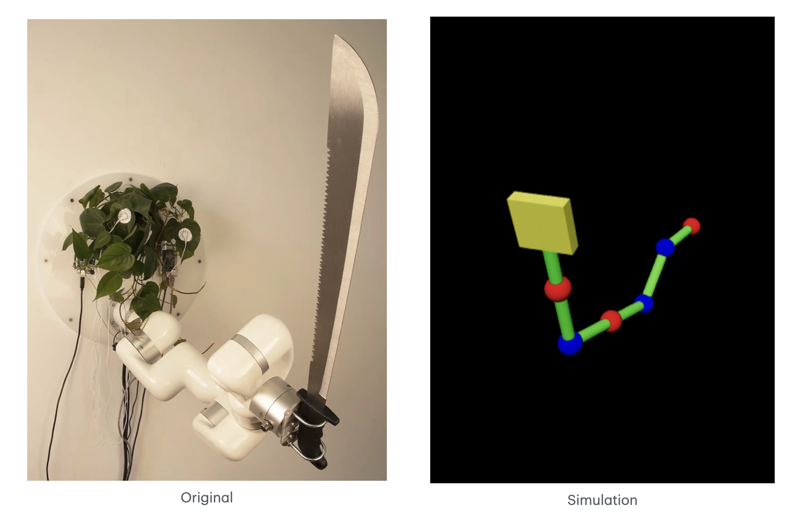
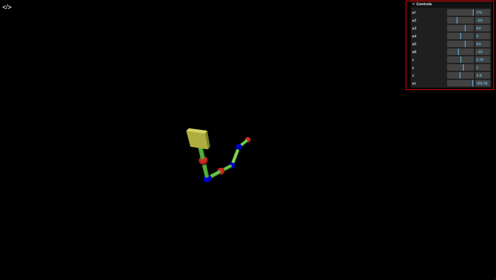
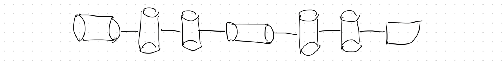

# Robotic Arm Simulation

This project simulates a [Plant Robotic Arm](https://mymodernmet.com/david-bowen-plant-machete/) using a stick-figure style. The simulation includes the following functionalities:

- **Forward Kinematics**: Computes the position of each joint and the end effector based on the input joint angles.
- **Inverse Kinematics**: Calculates the joint angles required to achieve a specific end effector position and orientation.
- **Visualization**: Displays a stick-figure representation of the robotic arm using [Three.js](https://threejs.org/).



## Getting Started

You can explore the project in two ways:

- **Online**: Visit [robotic-arm.bairui.dev](https://robotic-arm.bairui.dev/).
- **Local**: `pnpm install && pnpm run dev`

Once you access the webpage, you’ll find a control panel in the top-right corner. You can interact with the robotic arm by adjusting the sliders:

- **a1, a2, a3, a4, a5, a6**: Control the joint angles.
- **x, y, z, az**: Control the end effector's position and orientation.



## Implementation

The original plant robotic arm is quite complex, so I simplified its structure as shown below:



### Joint Types

There are two types of joints in this structure:

- **Revolute Joints**: Represented in blue.
- **Cylindrical Joints**: Represented in red.

### Forward Kinematics

After assigning coordinates to the frames and deriving the Denavit-Hartenberg (DH) parameter table, I implemented _forwardKinematics(joints)_ using Three.js matrix utilities:

```js
function forwardKinematics([a1, a2, a3, a4, a5, a6]) {
  const T1 = dhTransform(a1 - Math.PI / 2, -Math.PI / 2, linkLength, 0);
  const T2 = dhTransform(a2 - Math.PI / 2, 0, 0, linkLength);
  const T3 = dhTransform(a3, 0, 0, linkLength);
  const T4 = dhTransform(0, a4, 0, linkLength);
  const T5 = dhTransform(a5, 0, 0, linkLength);
  const T6 = dhTransform(0, a6, 0, linkLength);

  const T01 = T1;
  const T02 = new THREE.Matrix4().multiplyMatrices(T01, T2);
  const T03 = new THREE.Matrix4().multiplyMatrices(T02, T3);
  const T04 = new THREE.Matrix4().multiplyMatrices(T03, T4);
  const T05 = new THREE.Matrix4().multiplyMatrices(T04, T5);
  const T06 = new THREE.Matrix4().multiplyMatrices(T05, T6);

  const p0 = new THREE.Vector3(0, 0, 0);
  const p1 = new THREE.Vector3().applyMatrix4(T01);
  const p2 = new THREE.Vector3().applyMatrix4(T02);
  const p3 = new THREE.Vector3().applyMatrix4(T03);
  const p4 = new THREE.Vector3().applyMatrix4(T04);
  const p5 = new THREE.Vector3().applyMatrix4(T05);
  const p6 = new THREE.Vector3().applyMatrix4(T06);

  return {
    positions: [p0, p1, p2, p3, p4, p5, p6],
  };
}

function dhTransform(theta, alpha, d, a) {
  // prettier-ignore
  return new THREE.Matrix4(
    Math.cos(theta), -Math.sin(theta) * Math.cos(alpha), Math.sin(theta) * Math.sin(alpha), a * Math.cos(theta),
    Math.sin(theta), Math.cos(theta) * Math.cos(alpha), -Math.cos(theta) * Math.sin(alpha), a * Math.sin(theta),
    0, Math.sin(alpha), Math.cos(alpha), d,
    0, 0, 0, 1
  );
}
```

### Inverse Kinematics

Implementing forward kinematics is straightforward, but inverse kinematics is more complex due to six variables. I simplified the implementation as follows:

- Use the last cylindrical joint to achieve the end effector's orientation.
- Use the first cylindrical joint to control the end effector's x-offset.
- Compute the distance between the position and the z-axis, and use this as the y-coordinate for a 3-link planar manipulator.
- Use the first revolute joint for alignment and the remaining revolute joints for a 2-link planar manipulator.

```js
function inverseKinematics([x, y, z, rotateX, rotateY, rotateZ]) {
  const dz = Math.sqrt(x * x + y * y);
  const az = Math.atan2(x, y);
  const angles = inverseKinematics3(z - linkLength, dz, linkLength, linkLength * 2, linkLength * 2);
  return {
    angles: [az, angles[0], angles[1], 0, angles[2], rotateZ],
  };
}

function inverseKinematics2(px, py, a1, a2) {
  const c2 = (px * px + py * py - a2 * a2 - a1 * a1) / (2 * a1 * a2);

  if (c2 > 1) return [0, 0];
  if (c2 < -1) return [0, Math.PI];

  const s2 = Math.sqrt(1 - c2 * c2);
  const t2 = Math.atan2(s2, c2);
  const t1 = Math.atan2(py, px) - Math.atan2(a2 * s2, a1 + a2 * c2);
  return [t1, t2];
}

function inverseKinematics3(px, py, a1, a2, a3) {
  const r = Math.sqrt(px * px + py * py);
  if (r > a1 && r < a1 + a2 + a3) {
    const t1 = Math.atan2(py, px);
    const npx = px - a1 * Math.cos(t1);
    const npy = py - a1 * Math.sin(t1);
    const [t2, t3] = inverseKinematics2(npx, npy, a2, a3);
    return [t1, t2, t3];
  }
  return [null, null, null];
}
```

## Future Work

- Optimize _inverseKinematics2_
- Inverse Dynamics with the Jacobian
- Inverse Kinematics with the Jacobian
- Workspace Computation
- Trajectory Optimization
